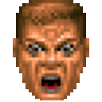

# Macramoji
[](https://badge.fury.io/js/macramoji)
[](https://travis-ci.org/ifreecarve/macramoji)

A slack-centric programming language for altering emoji

# How it works

Macramoji parses a simple functional programming language for emoji, where function names can either precede or follow the parenthesis and emoji are slack-style (i.e. beginning and ending with a `:`).  For example:

```
(dealwithit(:rage1:, :kamina-glasses:))splosion
```

This produces the following gif (assuming you have `kamina-glasses`):




# Reference Implementation: Hubot script

This script allows you to message a hubot instance with the command `emojify (dealwithit(:rage1:, :kamina-glasses:))splosion`

```coffee
macramoji = require 'macramoji'
refreshSeconds = 15 * 60 # refesh emoji list every 15 minutes
module.exports = (robot) ->
  emojiStore = new macramoji.EmojiStore(robot.adapter.client.web, refreshSeconds)
  processor = new macramoji.EmojiProcessor(emojiStore, macramoji.defaultMacros)

  robot.respond /emojify (.*)/i, (res) ->
    emojiStr = res.match[1].trim()
    processor.process emojiStr, (slackResp) ->
      slackResp.respond(res)
```

# TODO

* Check that proper cleanup is happening
* Enable slack reponses without hubot
